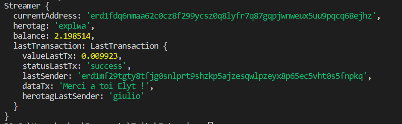

# Twitch_extension for Elrond 

## Développement d'une extension Twitch qui permet d'afficher les dons fait sur Maiar

## Installation

### Installer node js
> https://nodejs.org/fr/download/

### Installer les packages

Commande dans le terminal:

> npm init

> npm install --save elrondjs

### Execution

> node elrond

### Resultats 

 

### Problèmes

- La fonction pour exécuter et vérifier la dernière tx se fait toutes les secondes si il y a plusieurs transactions entre cette seconde, je vais pas les prendre en compte
- Je ne sais pas si toutes les fonctions Async (thread) se passe toujours comme il faut
- J'ai utiliser une file pour y mettre les dernières transactions mais ce n'est pas encore fait comme il faut
- Et étant donné que c'est la première fois que je touche à du node js & javascript je ne sais pas si mon code est clean
